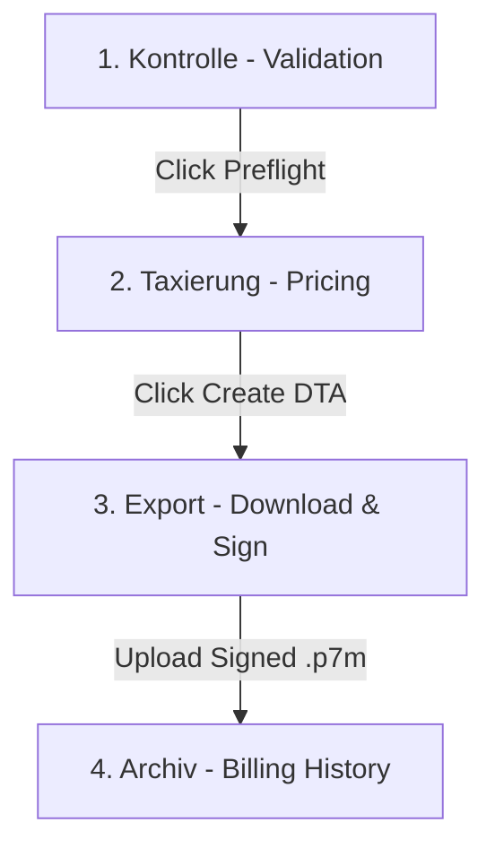

# OPTICA PARITY PLAN: Direct Kassenabrechnung Integrations

This planning document outlines the technical design, database migrations, backend endpoint specifications, frontend UI adjustments, testing plans, and risks for the four direct Kassenabrechnung features in InfinityMade.

---

### What is Already Done vs. What This Plan Adds

A prior automated audit made several incorrect assumptions about the codebase. **The following assets already exist in the system and are fully operational; they do NOT need to be re-planned or rebuilt:**
1. **Heilmittel-Position override UI**: Fully operational in `dashboard.js` (`buildPositionOptionsHtml`, `loadPhysioPositions`, `renderAbrechnungReady`, and inline saving to `prescriptions.heilmittel_position`).
2. **Begleitzettel**: Already generated and uploaded during `abrechnung.routes.js` create flow, with templates in `begleitzettel.template.js` and a download trigger in the frontend.
3. **ZAA upload + error display**: Fully implemented in `openZaaModal`, `showZaaErrors`, and the backend parsing logic (`parser.js` + `error-translations.js`).
4. **Zuzahlung calculations & exemption templates**: Calculator (`zuzahlung/calculator.js`), PDF template (`zuzahlungsrechnung.template.js`), and the automatic database trigger (`database_v19_befreiung_auto_flag.sql`) are complete.
5. **§302 engine**: Uses **EDIFACT (not XML)** format, with builder, preflight rules (30+ rules in `dta/preflight.js`), PKCS#7 browser-side signing, and backend routes in place.
6. **Therapiebericht field mapping**: The DTA EDIFACT engine already maps `therapieberichtAngefordert` in `dta/builder.js` and `dta/segments.js`.

**This plan adds the missing parity features:**
1. A front-end printable HTML/PDF **Zuzahlungsrechnung co-payment invoice generation flow** + one-click links in ZAA errors to resolve issues.
2. Gating of **Therapieberichte (Physician Reports)**, which enforces completion before billing.
3. A structured **4-stage pipeline wizard UI** for §302 billing.
4. A genuinely new, immutable, append-only **GoBD-compliant Belegliste (cash/receipt ledger)**.

---

## 1. Quick Win: Zuzahlung Print Button & ZAA Fix Links

Currently, the backend co-payment calculator and PDF template exist, but there is no UI pathway to generate or print a Zuzahlungsrechnung (co-payment invoice). Additionally, ZAA error displays show codes but do not link directly back to the offending prescription.

### Exact Files to Modify/Create

#### [MODIFY] [abrechnung.routes.js](file:///C:/Users/Test/Desktop/claude/website/api-backend/billing/api/abrechnung.routes.js)
Add a new GET route to retrieve and compile data, rendering the existing `zuzahlungsrechnung.template.js` as a printable A4 invoice.

```javascript
// GET /api/billing/prescription/:id/zuzahlungsrechnung
// Renders print-ready co-payment invoice for a patient's prescription
import { renderZuzahlungsrechnung } from '../pdf/zuzahlungsrechnung.template.js';
import { calcAbrechnungsfallZuzahlung } from '../zuzahlung/calculator.js';
import { findPosition } from '../codes/physio_positions.js';

router.get('/prescription/:id/zuzahlungsrechnung', async (req, res) => {
  try {
    // ---- Auth ----
    const token = req.query.token || req.headers.authorization?.slice(7);
    if (!token) return res.status(401).send('Nicht autorisiert');
    const { data: { user }, error: uErr } = await supabase.auth.getUser(token);
    if (uErr || !user) return res.status(401).send('Ungültiges Token');

    const { data: profile } = await supabase
      .from('profiles').select('id, role, owner_id, business_name, phone, city, zip, street, house_number, ik_number')
      .eq('id', user.id).single();
    const tenantId = profile?.role === 'employee' && profile?.owner_id ? profile.owner_id : user.id;

    // ---- Fetch Prescription + Leads + Arzt + Sessions ----
    const { data: rx, error: rxErr } = await supabase
      .from('prescriptions')
      .select(`
        *,
        leads:patient_id (first_name, last_name, geburtsdatum, versichertennummer, krankenkasse, street, plz, city),
        aerzte:arzt_id (arzt_name),
        prescription_sessions (id, session_number, status, done_at)
      `)
      .eq('id', req.params.id)
      .single();

    if (rxErr || !rx) return res.status(404).send('Rezept nicht gefunden');
    if (rx.owner_id !== tenantId) return res.status(403).send('Kein Zugriff');

    // ---- Map Sessions & Calculate Totals ----
    const storedPos = rx.heilmittel_position || '';
    const pos = findPosition(storedPos, '22'); // default Physio code
    const priceUnit = pos?.preis ?? 0;
    const coPayUnit = pos?.zuzahlung ?? (priceUnit * 0.10);

    const doneSessions = (rx.prescription_sessions || [])
      .filter(s => s.status === 'done');

    const calcSessions = doneSessions.map(s => ({
      preis_eur: priceUnit,
      zuzahlung_eur_position: rx.zuzahlung_befreit ? 0 : coPayUnit,
      position_frei: rx.zuzahlung_befreit
    }));

    const totals = calcAbrechnungsfallZuzahlung({
      sessions: calcSessions,
      patient: { geburtsdatum: rx.leads.geburtsdatum, befreit_im_jahr: rx.zuzahlung_befreit },
      behandlungsende: doneSessions.length ? doneSessions[doneSessions.length - 1].done_at : new Date(),
      verordnung_zuzahlungsfrei: rx.zuzahlung_befreit
    });

    const printSessions = doneSessions.map(s => ({
      datum: s.done_at,
      position: storedPos,
      bezeichnung: rx.heilmittel || 'Physiotherapeutische Behandlung',
      brutto: priceUnit,
      zuzahlung: rx.zuzahlung_befreit ? 0 : coPayUnit
    }));

    // ---- Render PDF/HTML Template ----
    const html = renderZuzahlungsrechnung({
      praxis: {
        name: profile.business_name || 'Praxis für Physiotherapie',
        strasse: [profile.street, profile.house_number].filter(Boolean).join(' '),
        plz_ort: [profile.zip, profile.city].filter(Boolean).join(' '),
        telefon: profile.phone || '',
        ik: profile.ik_number || rx.doctor_bsnr || '',
        steuernummer: '',
        email: user.email || ''
      },
      patient: {
        nachname: rx.leads.last_name || '',
        vorname: rx.leads.first_name || '',
        strasse: rx.leads.street || '',
        plz: rx.leads.plz || '',
        ort: rx.leads.city || '',
        geburtsdatum: rx.leads.geburtsdatum || '',
        kvnr: rx.leads.versichertennummer || ''
      },
      verordnung: {
        ausstellungsdatum: rx.ausstellungsdatum,
        krankenkasse: rx.leads.krankenkasse,
        arzt: rx.aerzte?.arzt_name || 'Hausarzt'
      },
      rechnung: {
        nummer: `ZU-${rx.id.slice(0, 8).toUpperCase()}`,
        datum: new Date(),
        faelligkeit: new Date(Date.now() + 14 * 24 * 60 * 60 * 1000) // 14 days due date
      },
      sessions: printSessions,
      totals,
      bankverbindung: 'DE89 1002 0030 0040 0500 00 (Musterbank)'
    });

    res.set('Content-Type', 'text/html; charset=utf-8');
    return res.send(html);
  } catch (e) {
    console.error('[zuzahlungsrechnung/print]', e);
    return res.status(500).send('Server-Fehler: ' + e.message);
  }
});
```

#### [MODIFY] [dashboard.js](file:///C:/Users/Test/Desktop/claude\website/dashboard.js)
1. **Zuzahlung Print Button**: In `loadPatientDetailRezepte(leadId)` (~L3657), inside the returned HTML template for `rxs.map(...)`, insert a print button adjacent to `abrButton` (~L3722) or at the bottom actions area:
   ```javascript
   const zuzahlungPrintBtn = `<button class="btn-ghost btn-sm rx-print-zuzahlung" data-id="${rx.id}" title="Zuzahlungsrechnung drucken">📄 Zuzahlung</button>`;
   ```
   Wire the event handler in `loadPatientDetailRezepte` (~L3741):
   ```javascript
   content.querySelectorAll('.rx-print-zuzahlung').forEach(btn => {
     btn.addEventListener('click', async () => {
       const { data: { session: s } } = await supabase.auth.getSession();
       const printWindow = window.open(`${API}/billing/prescription/${btn.dataset.id}/zuzahlungsrechnung?token=${s.access_token}`, '_blank');
       if (printWindow) {
         printWindow.onload = () => {
           printWindow.print();
         };
       } else {
         showToast('Popup-Blocker verhindert das Öffnen des Druckfensters.', 'error');
       }
     });
   });
   ```
2. **ZAA Error Fix-Links**: In `showZaaErrors` (~L10664), modify the error mapping to render active anchor tags:
   ```javascript
   out.innerHTML = `<table class="data-table"><thead><tr><th>Code</th><th>Status</th><th>Fehler</th><th>Aktion</th></tr></thead><tbody>
     ${data.map(e => {
       const actionLink = e.prescription_id
         ? `<a href="#" class="zaa-fix-link" data-rx="${escapeHtml(e.prescription_id)}" style="color:var(--primary);text-decoration:underline;font-weight:600;">Beheben</a>`
         : '—';
       return `<tr>
         <td><code>${escapeHtml(e.fehler_code)}</code></td>
         <td>${escapeHtml(e.status)}</td>
         <td>${escapeHtml(e.uebersetzung || e.fehler_text || '')}</td>
         <td>${actionLink}</td>
       </tr>`;
     }).join('')}
   </tbody></table>`;
   ```
   Add the event listener at the end of `showZaaErrors`:
   ```javascript
   out.querySelectorAll('.zaa-fix-link').forEach(link => {
     link.addEventListener('click', async (e) => {
       e.preventDefault();
       const rxId = link.dataset.rx;
       closeModal('zaaModal');
       
       // Query patient (lead_id) associated with this prescription
       const { data: rx } = await supabase
         .from('prescriptions')
         .select('patient_id')
         .eq('id', rxId)
         .single();
         
       if (rx?.patient_id) {
         const { data: lead } = await supabase
           .from('leads')
           .select('*')
           .eq('id', rx.patient_id)
           .single();
           
         if (lead) {
           openPatientDetailModal(lead);
           // Wait for tabs to render, then click the "Rezepte" tab
           setTimeout(() => {
             const tab = document.getElementById('pdTabRezepte');
             if (tab) tab.click();
           }, 300);
         }
       }
     });
   });
   ```

### Tests to Add

#### [NEW] [zuzahlungPrint.test.js](file:///C:/Users/Test/Desktop/claude/website/api-backend/billing/zuzahlung/zuzahlungPrint.test.js)
Write a Jest test to assert that rendering matches:
- Authentic calculation values.
- Formatted German address strings.
- Complete 10% co-payment calculation + 10€ fee.

```javascript
import { renderZuzahlungsrechnung } from '../pdf/zuzahlungsrechnung.template.js';

describe('Zuzahlungsrechnung HTML generation', () => {
  it('correctly maps fields to A4 printout structure', () => {
    const opts = {
      praxis: { name: 'Therapiezentrum', strasse: 'Musterweg 1', plz_ort: '53721 Siegburg', telefon: '123' },
      patient: { vorname: 'Jane', nachname: 'Doe', strasse: 'Bahnstr. 4', plz: '53721', ort: 'Siegburg' },
      rechnung: { nummer: 'ZU-12345', datum: new Date(), faelligkeit: new Date() },
      sessions: [{ datum: new Date(), position: 'X0501', bezeichnung: 'KG', brutto: 35.00, zuzahlung: 3.50 }],
      totals: { brutto: 35.00, prozZuzahlung: 3.50, pauschZuzahlung: 10.00, gesZuzahlung: 13.50 }
    };
    const html = renderZuzahlungsrechnung(opts);
    expect(html).toContain('ZU-12345');
    expect(html).toContain('Jane Doe');
    expect(html).toContain('13,50 €');
  });
});
```

---

## 2. Gating of Therapieberichte (Physician Reports)

When physicians request clinical report feedback (`bericht_angefordert`), billing must be blocked until the report is confirmed as finalized (`bericht_status = 'erledigt'`).

### DB Migration

#### [NEW] [database_v26_bericht_gating.sql](file:///C:/Users/Test/Desktop/claude/website/database_v26_bericht_gating.sql)
```sql
-- Create an enum type representing the state of the clinical report
DO $$
BEGIN
  IF NOT EXISTS (SELECT 1 FROM pg_type WHERE typname = 'bericht_status_type') THEN
    CREATE TYPE bericht_status_type AS ENUM ('offen', 'in_arbeit', 'erledigt');
  END IF;
END$$;

-- Add tracking columns directly to prescriptions
ALTER TABLE public.prescriptions 
  ADD COLUMN IF NOT EXISTS bericht_angefordert BOOLEAN DEFAULT FALSE NOT NULL,
  ADD COLUMN IF NOT EXISTS bericht_status bericht_status_type DEFAULT 'offen' NOT NULL;

-- Enable indexing for search filtering
CREATE INDEX IF NOT EXISTS idx_prescriptions_bericht_status 
  ON public.prescriptions (bericht_angefordert, bericht_status);
```

### Exact Files to Modify/Create

#### [MODIFY] [preflight.js](file:///C:/Users/Test/Desktop/claude/website/api-backend/billing/dta/preflight.js)
Integrate the report completion rule as a preflight validation constraint.

```javascript
// Add reporting constraint inside the prescriptions loop (around ~L203, after verordnung parsing)
const v = p.verordnung || {};
if (v.berichtAngefordert && v.berichtStatus !== 'erledigt') {
  E(errors, 'V:01009', `${at}.verordnung`, `Therapiebericht angefordert aber ausstehend (Status: "${v.berichtStatus || 'offen'}")`);
}
```

#### [MODIFY] [abrechnung.routes.js](file:///C:/Users/Test/Desktop/claude/website/api-backend/billing/api/abrechnung.routes.js)
1. In `mapPrescriptionToDtaShape` (~L48), map fields into the DTA payload:
   ```javascript
   verordnung: {
     ...
     berichtAngefordert: rx.bericht_angefordert,
     berichtStatus: rx.bericht_status,
   }
   ```
2. In `/abrechnung/create` endpoint (~L182), select the columns `bericht_angefordert, bericht_status` inside `.select(...)` and add a hard-gate blocker:
   ```javascript
   for (const r of rxRows) {
     if (r.bericht_angefordert && r.bericht_status !== 'erledigt') {
       return res.status(400).json({ 
         error: `Abrechnung blockiert: Das Rezept ${r.id.slice(0,8)} erfordert einen ausgefüllten Therapiebericht, der noch nicht 'erledigt' ist.` 
       });
     }
   }
   ```

#### [MODIFY] [dashboard.html](file:///C:/Users/Test/Desktop/claude/website/dashboard.html)
Add inputs for physician reports in both manual entry and AI scan confirm modals.
1. **Manual Entry (`rezeptModal`)** — Insert a new form row (~L2071, before Befund):
   ```html
   <div class="form-row">
     <div class="form-group" style="align-self:end;">
       <label style="display:flex;align-items:center;gap:8px;cursor:pointer;font-size:14px;">
         <input type="checkbox" id="rzBerichtAngefordert" /> Bericht angefordert
       </label>
     </div>
     <div class="form-group">
       <label class="form-label">Bericht-Status</label>
       <select class="form-select" id="rzBerichtStatus">
         <option value="offen">Offen</option>
         <option value="in_arbeit">In Arbeit</option>
         <option value="erledigt">Erledigt</option>
       </select>
     </div>
   </div>
   ```
2. **AI Scan Confirm (`rezeptConfirmModal`)** — Insert a similar row (~L2254, before footer buttons):
   ```html
   <div class="form-row" style="margin-top:10px;">
     <div class="form-group" style="align-self:end;">
       <label style="display:flex;align-items:center;gap:8px;cursor:pointer;font-size:14px;">
         <input type="checkbox" id="rxcBerichtAngefordert" /> Bericht angefordert
       </label>
     </div>
     <div class="form-group">
       <label class="form-label">Bericht-Status</label>
       <select class="form-select" id="rxcBerichtStatus">
         <option value="offen">Offen</option>
         <option value="in_arbeit">In Arbeit</option>
         <option value="erledigt">Erledigt</option>
       </select>
     </div>
   </div>
   ```

#### [MODIFY] [dashboard.js](file:///C:/Users/Test/Desktop/claude/website/dashboard.js)
1. **Manual Entry Modal Wiring**:
   - In `openRezeptModal(...)` (~L9170), initialize the new fields:
     ```javascript
     document.getElementById('rzBerichtAngefordert').checked = false;
     document.getElementById('rzBerichtStatus').value = 'offen';
     ```
   - In `saveRezept(...)` (~L9193), capture fields in the POST payload:
     ```javascript
     berichtAngefordert: document.getElementById('rzBerichtAngefordert').checked,
     berichtStatus: document.getElementById('rzBerichtStatus').value,
     ```
2. **AI Scan Confirm Modal Wiring**:
   - In `openRezeptConfirmModal(payload)` (~L9870):
     ```javascript
     setChk('rxcBerichtAngefordert', rez.bericht_angefordert);
     setVal('rxcBerichtStatus', rez.bericht_status || 'offen');
     ```
   - In `submitConfirm()` (~L9962), add parameters to `parsedEdited.rezept`:
     ```javascript
     bericht_angefordert: document.getElementById('rxcBerichtAngefordert').checked,
     bericht_status: document.getElementById('rxcBerichtStatus').value
     ```
3. **Ready Group Warnings**: In `renderAbrechnungReady` (~L10403), inside the table mapping (~L10455), add a warning badge next to the patient's name if a report is required but missing:
   ```javascript
   const reportBadge = (rx.bericht_angefordert && rx.bericht_status !== 'erledigt')
     ? `<div style="margin-top:4px;"><span class="badge" style="background:#fee2e2;color:#b91c1c;font-size:11px;" title="Therapiebericht fehlt!">⚠️ Bericht fehlt (${rx.bericht_status})</span></div>`
     : '';
   ```
   Add `${reportBadge}` underneath the `${escapeHtml(pname)}` output inside the table row.
4. **State Transition Gate**: In `flipAbrechnungStatus` (~L3754), reject moving status to `'bereit'` if report requirements are unfulfilled:
   ```javascript
   if (newStatus === 'bereit' && rx.bericht_angefordert && rx.bericht_status !== 'erledigt') {
     showToast('Abgelehnt: Therapiebericht fehlt!', 'error');
     return;
   }
   ```

### Tests to Add

#### [MODIFY] [preflight.test.js](file:///C:/Users/Test/Desktop/claude/website/api-backend/billing/dta/preflight.test.js)
Append a test block asserting report validation.
```javascript
it('blocks validation if physician report is requested but status is not completed', () => {
  const payload = {
    absender: { ik: '888888888' },
    empfaenger: { ik: '123456789' },
    rechnung: { sammelRechnungsnummer: 'R2026', datennummer: 1 },
    prescriptions: [{
      patient: { kvnr: 'A123456789', versichertenstatus: '10000', nachname: 'a', vorname: 'b', geburtsdatum: '1990-01-01', belegnummer: '1' },
      verordnung: { ausstellungsdatum: '2026-01-01', icd10: 'M54.5', diagnosegruppe: 'WS2', verordnungsart: '03', zuzahlungskennzeichen: '1', leitsymptomatik: 'Pain', therapiefrequenz: '2x', berichtAngefordert: true, berichtStatus: 'offen' },
      sessions: [{ positionsnummer: '20501', datumLeistung: '2026-01-02', einzelbetrag: 30, anzahl: 10 }]
    }]
  };
  const res = preflight(payload);
  expect(res.ok).toBe(false);
  expect(res.errors[0].code).toBe('V:01009');
});
```

---

## 3. § 302 4-Stage Pipeline UI (Wizard)

Currently, billing is handled on a single dense view. Reorganizing this into a step-by-step pipeline guarantees clean user actions without introducing database modifications.



### Exact Files to Modify/Create

#### [NEW] [preflight-endpoint] inside [abrechnung.routes.js](file:///C:/Users/Test/Desktop/claude/website/api-backend/billing/api/abrechnung.routes.js)
Create a preflight POST route allowing simulated runs before database entry.
```javascript
// POST /api/billing/abrechnung/preflight
// Simulates billing DTA parsing to detect errors in Stage 1
import { preflight } from '../dta/preflight.js';

router.post('/abrechnung/preflight', async (req, res) => {
  try {
    const { prescriptionIds } = req.body;
    // Query prescriptions, leads, aerzte (identically to /abrechnung/create)
    // Map array using mapPrescriptionToDtaShape
    const prescriptions = rxRows.map(r => mapPrescriptionToDtaShape(r, r.leads, r.aerzte));
    const results = preflight({
      absender: { ik: cert.ik_nummer, name: profile.business_name || 'Praxis' },
      empfaenger: { ik: dasIk, name: kk.name },
      rechnung: { sammelRechnungsnummer: 'TEST', datennummer: 1, datum: new Date() },
      prescriptions
    });
    return res.json({ ok: true, results });
  } catch (e) {
    return res.status(500).json({ error: e.message });
  }
});
```

#### [MODIFY] [dashboard.html](file:///C:/Users/Test/Desktop/claude/website/dashboard.html)
Restructure `#panel-abrechnung` (~L920-L956) into a multi-step tabbed wizard view.

```html
<section class="panel" id="panel-abrechnung">
  <div class="panel-header">
    <div>
      <h2>Kassenabrechnung</h2>
      <p class="panel-sub">Sammelrechnung § 302 SGB V an Krankenkassen</p>
    </div>
  </div>

  <!-- Wizard Steps Header Links -->
  <div class="wizard-nav" style="display:flex;justify-content:space-between;margin-bottom:20px;border-bottom:1px solid var(--border);padding-bottom:10px;">
    <button class="wiz-btn active" data-step="1">1. Kontrolle (Validation)</button>
    <button class="wiz-btn" data-step="2">2. Taxierung (Pricing)</button>
    <button class="wiz-btn" data-step="3">3. Export (Download/Sign)</button>
    <button class="wiz-btn" data-step="4">4. Archiv (History)</button>
  </div>

  <!-- STAGE 1: Validation -->
  <div class="wizard-panel active" id="abStep1">
    <div class="card">
      <h3>1. Kontrolle: Rezepte prüfen</h3>
      <p style="font-size:13px;color:var(--text-muted);margin-bottom:14px;">Select prescriptions to validate against 30+ Datenannahmestelle formatting checks.</p>
      <div id="abReadyGroups"></div>
      <div id="abReadyEmpty" class="table-empty">Keine abrechnungsbereiten Rezepte.</div>
      <button class="btn-primary" id="abRunPreflightBtn" style="margin-top:10px;">Preflight-Check ausführen</button>
      <div id="abPreflightResults" style="margin-top:16px;"></div>
    </div>
  </div>

  <!-- STAGE 2: Taxierung -->
  <div class="wizard-panel" id="abStep2" hidden>
    <div class="card">
      <h3>2. Taxierung: Heilmittelposition & Preise</h3>
      <div id="abTaxierungList"></div>
      <div style="display:flex;justify-content:space-between;align-items:center;margin-top:16px;">
        <button class="btn-ghost" onclick="setWizardStep(1)">‹ Zurück zur Kontrolle</button>
        <button class="btn-primary" id="abGenerateDtaBtn">Rechnung finalisieren & DTA erstellen ›</button>
      </div>
    </div>
  </div>

  <!-- STAGE 3: Export -->
  <div class="wizard-panel" id="abStep3" hidden>
    <div class="card">
      <h3>3. Export: EDIFACT-Paket & Begleitzettel</h3>
      <div id="abExportActiveBox" style="padding:15px;background:var(--bg-card-solid);border-radius:8px;margin-bottom:15px;">
        <p>Abrechnung erfolgreich generiert!</p>
        <div style="display:flex;gap:10px;margin-top:10px;">
          <button class="btn-primary" id="abDownloadActiveDta">DTA Datei Herunterladen</button>
          <button class="btn-ghost" id="abDownloadActiveBeg">Begleitzettel Herunterladen</button>
          <button class="btn-primary" id="abSignActiveDta">✍ Digital Signieren (.p7m)</button>
        </div>
      </div>
      <button class="btn-ghost" onclick="setWizardStep(2)">‹ Zurück zur Taxierung</button>
    </div>
  </div>

  <!-- STAGE 4: Archiv -->
  <div class="wizard-panel" id="abStep4" hidden>
    <div class="card">
      <h3>4. Archiv: Historie & ZAA Status</h3>
      <div class="table-wrap">
        <table class="data-table">
          <thead>
            <tr>
              <th>Dateiname</th>
              <th>Krankenkasse</th>
              <th>Rezepte</th>
              <th>Summe</th>
              <th>Status</th>
              <th></th>
            </tr>
          </thead>
          <tbody id="abHistoryBody"></tbody>
        </table>
        <div id="abHistoryEmpty" class="table-empty">Noch keine Abrechnungen erstellt.</div>
      </div>
    </div>
  </div>
</section>
```

#### [MODIFY] [dashboard.js](file:///C:/Users/Test/Desktop/claude/website/dashboard.js)
1. **Wizard State Handler**:
   ```javascript
   function setWizardStep(stepNum) {
     document.querySelectorAll('.wizard-panel').forEach((el, idx) => {
       el.hidden = (idx + 1) !== stepNum;
     });
     document.querySelectorAll('.wiz-btn').forEach((btn, idx) => {
       btn.classList.toggle('active', (idx + 1) === stepNum);
       btn.style.color = (idx + 1) === stepNum ? 'var(--primary)' : 'var(--text-muted)';
     });
   }
   
   // Hook up navigation buttons
   document.querySelectorAll('.wiz-btn').forEach(btn => {
     btn.addEventListener('click', () => {
       setWizardStep(parseInt(btn.dataset.step));
     });
   });
   ```
2. **Integrate Stages**:
   - In `loadAbrechnung` (~L3680): Query both active ready items and history. If no ready items are available, default active panel view to Stage 4 (Archiv) via `setWizardStep(4)`. If there are items, default to Stage 1.
   - **Stage 1 Validation Hook**: Hook `#abRunPreflightBtn` to send checked prescriptions to `/api/billing/abrechnung/preflight`. Render warnings/blockers into `#abPreflightResults` using existing HTML format from `renderValidationBanner()`. If error-free, unlock/enable the navigation step to Stage 2 (Taxierung).
   - **Stage 2 Taxierung Hook**: Render selected prescriptions alongside the dropdown positioning options (`buildPositionOptionsHtml`). Once reviewed, hook the "finalisieren" click trigger to dispatch `/abrechnung/create` POST requests, moving the user directly to Stage 3 on success.
   - **Stage 3 Export Hook**: Handle file downloads and trigger `openSignModal(...)` to generate a browser-side PKCS#7 `.p7m` envelope. Upon successful upload, direct the wizard to Stage 4 (Archiv).

---

## 4. GoBD-Compliant Immutable Belegliste Ledger

To satisfy stringent German tax auditing guidelines (GoBD), cash receipts and co-payments must be logged in a strictly sequential, multi-tenant scoped ledger. This ledger must be mathematically immune to deletion or edits, allowing corrections only via offsetting "Storno" reversal entries.

```
+------------+--------------------+------------+-------------+-----------------------------+
| Beleg-Nr.  | Timestamp          | Typ        | Betrag      | Referenztext                |
+------------+--------------------+------------+-------------+-----------------------------+
| 1001       | 25.05.2026 14:05   | zuzahlung  | 13,50 €     | Co-pay prescription rx_3a9b |
| 1002       | 25.05.2026 14:15   | barverkauf | 25,00 €     | Retail Massage voucher      |
| 1003       | 25.05.2026 14:30   | storno     | -25,00 €    | Offset ledger 1002 cancellation|
+------------+--------------------+------------+-------------+-----------------------------+
```

### DB Migration

#### [NEW] [database_v27_gobd_belegliste.sql](file:///C:/Users/Test/Desktop/claude/website/database_v27_gobd_belegliste.sql)
```sql
CREATE TABLE public.belegliste (
  id UUID PRIMARY KEY DEFAULT gen_random_uuid(),
  owner_id UUID NOT NULL REFERENCES public.profiles(id) ON DELETE RESTRICT,
  beleg_nr BIGINT NOT NULL,
  type TEXT NOT NULL CHECK (type IN ('zuzahlung', 'barverkauf', 'storno')),
  amount_eur NUMERIC(10,2) NOT NULL,
  patient_id UUID REFERENCES public.leads(id) ON DELETE SET NULL,
  prescription_id UUID REFERENCES public.prescriptions(id) ON DELETE SET NULL,
  abrechnung_id UUID REFERENCES public.abrechnung(id) ON DELETE SET NULL,
  reference_text TEXT,
  created_at TIMESTAMP WITH TIME ZONE DEFAULT timezone('utc'::text, now()) NOT NULL,
  created_by UUID REFERENCES auth.users(id) ON DELETE SET NULL,
  UNIQUE (owner_id, beleg_nr)
);

-- Indexing for high performance queries
CREATE INDEX IF NOT EXISTS idx_belegliste_owner_time 
  ON public.belegliste (owner_id, created_at DESC);

-- Strictly sequential beleg_nr generation per tenant
CREATE OR REPLACE FUNCTION set_next_beleg_nr()
RETURNS TRIGGER AS $$
DECLARE
  next_nr BIGINT;
BEGIN
  SELECT COALESCE(MAX(beleg_nr), 0) + 1 INTO next_nr
  FROM public.belegliste
  WHERE owner_id = NEW.owner_id;
  NEW.beleg_nr := next_nr;
  RETURN NEW;
END;
$$ LANGUAGE plpgsql;

CREATE TRIGGER trg_set_beleg_nr
  BEFORE INSERT ON public.belegliste
  FOR EACH ROW
  WHEN (NEW.beleg_nr IS NULL OR NEW.beleg_nr = 0)
  EXECUTE FUNCTION set_next_beleg_nr();

-- Bulletproof GoBD compliance trigger blocking UPDATE and DELETE queries
CREATE OR REPLACE FUNCTION prevent_belegliste_mod()
RETURNS TRIGGER AS $$
BEGIN
  RAISE EXCEPTION 'GoBD Belegliste ist unveränderlich. UPDATE und DELETE Operationen sind gesetzlich verboten!';
END;
$$ LANGUAGE plpgsql;

CREATE TRIGGER trg_prevent_belegliste_mod
  BEFORE UPDATE OR DELETE ON public.belegliste
  FOR EACH ROW EXECUTE FUNCTION prevent_belegliste_mod();

-- Row Level Security (RLS) policies
ALTER TABLE public.belegliste ENABLE ROW LEVEL SECURITY;

CREATE POLICY "Belegliste select scoping" ON public.belegliste
  FOR SELECT USING (
    auth.uid() = owner_id 
    OR auth.uid() IN (SELECT id FROM public.profiles WHERE owner_id = belegliste.owner_id)
  );

CREATE POLICY "Belegliste insert scoping" ON public.belegliste
  FOR INSERT WITH CHECK (
    auth.uid() = owner_id 
    OR auth.uid() IN (SELECT id FROM public.profiles WHERE owner_id = belegliste.owner_id)
  );
```

### Exact Files to Modify/Create

#### [MODIFY] [dashboard.html](file:///C:/Users/Test/Desktop/claude/website/dashboard.html)
1. Add a new sidebar navigation item inside `dashboard.html`. Since the sidebar is dynamically populated, the static HTML contains other panels. Define a panel block for the GoBD Kassenbuch:
   ```html
   <!-- ===== PANEL: GOBD BELEGLISTE ===== -->
   <section class="panel" id="panel-belegliste">
     <div class="panel-header">
       <div>
         <h2>GoBD-Kassenbuch (Belegliste)</h2>
         <p class="panel-sub">Gesetzlich unveränderliche, fortlaufende Aufzeichnung aller Kassenbewegungen</p>
       </div>
       <button class="btn-primary" id="blAddManualBtn">+ Barverkauf eintragen</button>
     </div>

     <div class="card" style="margin-bottom:16px;display:flex;gap:12px;flex-wrap:wrap;align-items:center;">
       <div class="form-group" style="margin:0;">
         <label class="form-label" style="font-size:11px;">Von</label>
         <input type="date" class="form-input" id="blFilterFrom" style="padding:4px 8px;width:auto;" />
       </div>
       <div class="form-group" style="margin:0;">
         <label class="form-label" style="font-size:11px;">Bis</label>
         <input type="date" class="form-input" id="blFilterTo" style="padding:4px 8px;width:auto;" />
       </div>
       <div class="form-group" style="margin:0;">
         <label class="form-label" style="font-size:11px;">Typ</label>
         <select class="form-select" id="blFilterType" style="padding:4px 8px;width:auto;">
           <option value="all">Alle Belege</option>
           <option value="zuzahlung">Zuzahlung</option>
           <option value="barverkauf">Barverkauf</option>
           <option value="storno">Storno / Reversal</option>
         </select>
       </div>
       <button class="btn-ghost" id="blExportCsvBtn" style="margin-top:14px;padding:6px 12px;font-size:13px;">CSV Export (Finanzamt)</button>
     </div>

     <div class="card">
       <div class="table-wrap">
         <table class="data-table">
           <thead>
             <tr>
               <th>Beleg-Nr.</th>
               <th>Datum & Zeit</th>
               <th>Typ</th>
               <th>Betrag</th>
               <th>Referenztext</th>
               <th>Bediener</th>
               <th>Aktion</th>
             </tr>
           </thead>
           <tbody id="beleglisteBody"></tbody>
         </table>
         <div id="beleglisteEmpty" class="table-empty" hidden>Keine Einträge vorhanden.</div>
       </div>
     </div>
   </section>

   <!-- ===== MODAL: BARVERKAUF EINTRAGEN ===== -->
   <div class="modal-overlay" id="manualBelegModal" hidden>
     <div class="modal">
       <div class="modal-header">
         <span class="modal-title">Manuellen Beleg erstellen</span>
         <button class="modal-close" data-modal="manualBelegModal">✕</button>
       </div>
       <div class="modal-body">
         <div class="form-group">
           <label class="form-label">Typ</label>
           <select class="form-input" id="blManualType">
             <option value="barverkauf">Barverkauf (Massage, Gutschein, etc.)</option>
           </select>
         </div>
         <div class="form-group">
           <label class="form-label">Betrag (EUR)</label>
           <input class="form-input" id="blManualAmount" type="number" step="0.01" placeholder="25.00" />
         </div>
         <div class="form-group">
           <label class="form-label">Referenztext</label>
           <input class="form-input" id="blManualRef" type="text" placeholder="z. B. 1x Gutschein Massage" />
         </div>
       </div>
       <div class="modal-footer">
         <button class="btn-ghost" data-modal="manualBelegModal">Abbrechen</button>
         <button class="btn-primary" id="blManualSaveBtn">Beleg erzeugen</button>
       </div>
     </div>
   </div>
   ```

#### [MODIFY] [dashboard.js](file:///C:/Users/Test/Desktop/claude/website/dashboard.js)
1. **Append Navigation Links**: Add a new item inside `SECTOR_PANELS.physiotherapy` (~L276) and `SECTOR_PANELS.praxis` (~L295):
   ```javascript
   { id: 'belegliste', icon: ICON.clipboard, key: 'nav_belegliste', roles: ['owner'] }
   ```
2. **Expose Translation Labels**: Add `nav_belegliste` and related UI texts into the translations block (`T.de`, `T.en`, `T.tr` around ~L65):
   ```javascript
   // de
   nav_belegliste: 'Kassenbuch (GoBD)',
   // en
   nav_belegliste: 'Cash Ledger (GoBD)',
   // tr
   nav_belegliste: 'Kasa Defteri (GoBD)',
   ```
3. **Core Kassenbuch Mechanics**:
   Add the ledger functions at the bottom of the file:
   ```javascript
   async function loadBelegliste() {
     const ownerId = getOwnerId();
     const tbody = document.getElementById('beleglisteBody');
     const empty = document.getElementById('beleglisteEmpty');
     if (!tbody) return;
     tbody.innerHTML = '';
     
     let query = supabase
       .from('belegliste')
       .select('beleg_nr, created_at, type, amount_eur, reference_text, created_by')
       .eq('owner_id', ownerId)
       .order('beleg_nr', { ascending: false });

     const typeFilter = document.getElementById('blFilterType')?.value;
     if (typeFilter && typeFilter !== 'all') {
       query = query.eq('type', typeFilter);
     }
     const from = document.getElementById('blFilterFrom')?.value;
     if (from) query = query.gte('created_at', `${from}T00:00:00Z`);
     const to = document.getElementById('blFilterTo')?.value;
     if (to) query = query.lte('created_at', `${to}T23:59:59Z`);

     const { data: rows, error } = await query;
     if (error) {
       showToast('Kassenbuch Fehler: ' + error.message, 'error');
       return;
     }

     if (!rows || !rows.length) {
       empty.style.display = '';
       return;
     }
     empty.style.display = 'none';

     rows.forEach(r => {
       const dateStr = new Date(r.created_at).toLocaleString('de-DE');
       const isNegative = Number(r.amount_eur) < 0;
       const color = isNegative ? '#b91c1c' : '#15803d';
       const tr = document.createElement('tr');
       
       const stornoBtn = r.type !== 'storno' 
         ? `<button class="btn-ghost btn-sm bl-storno-btn" data-nr="${r.beleg_nr}" data-val="${r.amount_eur}" data-ref="${escapeHtml(r.reference_text)}">Storno</button>`
         : '';

       tr.innerHTML = `
         <td style="font-family:monospace;">${String(r.beleg_nr).padStart(6, '0')}</td>
         <td>${dateStr}</td>
         <td><span class="badge badge-gray">${r.type}</span></td>
         <td style="color:${color};font-weight:600;text-align:right;">${fmtEur(r.amount_eur)}</td>
         <td>${escapeHtml(r.reference_text)}</td>
         <td>System</td>
         <td>${stornoBtn}</td>
       `;
       tbody.appendChild(tr);
     });

     // Wire Storno Event
     tbody.querySelectorAll('.bl-storno-btn').forEach(btn => {
       btn.addEventListener('click', () => triggerStorno(btn.dataset.nr, btn.dataset.val, btn.dataset.ref));
     });
   }

   async function triggerStorno(belegNr, amount, originalRef) {
     const confirm = await showConfirmModal({
       title: 'Beleg Stornieren',
       message: `Sind Sie sicher, dass Sie den Beleg Nr. ${belegNr} stornieren möchten? Es wird eine Gegenbuchung von -${amount} € erzeugt.`,
       confirmText: 'Beleg Stornieren',
       variant: 'danger'
     });
     if (!confirm) return;

     const { error } = await supabase.from('belegliste').insert({
       owner_id: getOwnerId(),
       type: 'storno',
       amount_eur: -Number(amount),
       reference_text: `STORNO für Beleg-Nr: ${belegNr} (${originalRef})`
     });

     if (error) {
       showToast('Storno gescheitert: ' + error.message, 'error');
     } else {
       showToast('Stornobuchung erzeugt ✓');
       loadBelegliste();
     }
   }

   // Register hooks for filters
   document.getElementById('blFilterType')?.addEventListener('change', loadBelegliste);
   document.getElementById('blFilterFrom')?.addEventListener('change', loadBelegliste);
   document.getElementById('blFilterTo')?.addEventListener('change', loadBelegliste);

   // Manual book sale handler
   document.getElementById('blAddManualBtn')?.addEventListener('click', () => {
     document.getElementById('blManualAmount').value = '';
     document.getElementById('blManualRef').value = '';
     openModal('manualBelegModal');
   });

   document.getElementById('blManualSaveBtn')?.addEventListener('click', async () => {
     const amount = Number(document.getElementById('blManualAmount').value);
     const ref = document.getElementById('blManualRef').value.trim();
     if (!amount || amount <= 0) return showToast('Betrag muss > 0 sein', 'error');
     if (!ref) return showToast('Referenztext erforderlich', 'error');

     const { error } = await supabase.from('belegliste').insert({
       owner_id: getOwnerId(),
       type: 'barverkauf',
       amount_eur: amount,
       reference_text: ref
     });

     if (error) {
       showToast('Buchung gescheitert: ' + error.message, 'error');
     } else {
       closeModal('manualBelegModal');
       showToast('Beleg erfolgreich gebucht ✓');
       loadBelegliste();
     }
   });
   
   // Hook panel transition
   const originalSwitchPanel = window.switchPanel;
   window.switchPanel = function(panelId) {
     if (panelId === 'belegliste') {
       loadBelegliste();
     }
     if (typeof originalSwitchPanel === 'function') {
       originalSwitchPanel(panelId);
     }
   };
   ```
4. **Feeds from Cash Events (Zuzahlung Paid)**:
   In `flipAbrechnungStatus(...)` (~L3754), if a prescription is marked paid, automatically dispatch a ledger entry inside `flipAbrechnungStatus` (or when user accepts Zuzahlung co-payment):
   ```javascript
   // Insert into cash ledger on co-payment paid event
   if (newStatus === 'accepted') {
     const { data: rxInfo } = await supabase.from('prescriptions').select('*, leads(first_name, last_name)').eq('id', rxId).single();
     if (rxInfo && rxInfo.zuzahlung_eur > 0) {
       await supabase.from('belegliste').insert({
         owner_id: getOwnerId(),
         type: 'zuzahlung',
         amount_eur: rxInfo.zuzahlung_eur,
         patient_id: rxInfo.patient_id,
         prescription_id: rxId,
         reference_text: `Zuzahlung erhalten: ${rxInfo.leads?.first_name} ${rxInfo.leads?.last_name}`
       });
     }
   }
   ```

### Tests to Add

#### [NEW] [belegliste.test.js](file:///C:/Users/Test/Desktop/claude/website/api-backend/billing/belegliste.test.js)
Verify through tests that the RLS + database trigger strictly block updates and deletions to guarantee immutable compliance.
```javascript
const { createClient } = require('@supabase/supabase-js');
const supabase = createClient(process.env.SUPABASE_URL, process.env.SUPABASE_ANON_KEY);

describe('GoBD Ledger Immutability', () => {
  it('allows insertions but blocks updates and deletions', async () => {
    // 1. Insert transaction
    const { data: ins, error: insErr } = await supabase.from('belegliste').insert({
      owner_id: 'test-uuid-owner',
      type: 'barverkauf',
      amount_eur: 50.00,
      reference_text: 'GoBD Test'
    }).select().single();
    
    expect(insErr).toBeNull();
    expect(ins.beleg_nr).toBeGreaterThan(0);

    // 2. Try to update it (Must fail)
    const { error: updErr } = await supabase
      .from('belegliste')
      .update({ amount_eur: 10.00 })
      .eq('id', ins.id);
      
    expect(updErr).not.toBeNull();
    expect(updErr.message).toContain('GoBD Belegliste ist unveränderlich');

    // 3. Try to delete it (Must fail)
    const { error: delErr } = await supabase
      .from('belegliste')
      .delete()
      .eq('id', ins.id);

    expect(delErr).not.toBeNull();
    expect(delErr.message).toContain('GoBD Belegliste ist unveränderlich');
  });
});
```

---

## Shared CSS Theme Requirements

All manual changes to HTML styles and CSS rules must respect the existing variable-based palette to prevent dark-mode color clashes. **Never hardcode hex values like `#fff` or `#111`.** Use the custom system variables defined in `dashboard.css`:
- **Card Backgrounds**: `var(--bg-card)` or `var(--bg-card-solid)`
- **Borders**: `var(--border)`
- **Primary Highlights**: `var(--primary)`
- **Body Text Color**: `var(--text-main)`
- **Muted Notes / Labels**: `var(--text-muted)`

When deploying any frontend assets, verify cache consistency by appending/updating the static query string parameter (e.g. change script loading to `dashboard.js?v=20260525d` inside `dashboard.html`).

---

## Recommended Build Sequence & Checklist

### Recommended Sequencing
To maintain stability, the features should be implemented in ascending order of complexity:

1. **Zuzahlung Print Flow (S)**: Risk-free additions to routes and UI cards that do not require database changes.
2. **Therapieberichte Gating (M)**: Requires database migrations and wires logic loops into UI modals, but leverages existing preflight files.
3. **§302 Wizard Restructure (M)**: High visual impact front-end refactor, relying on existing backend routines.
4. **GoBD Ledger Page (L)**: Requires rigorous testing of security policies and append-only database triggers to ensure compliance.

### Implementation Checklist
- [ ] Run migration `database_v26_bericht_gating.sql` to add reporting fields.
- [ ] Run migration `database_v27_gobd_belegliste.sql` to instantiate the immutable Belegliste table.
- [ ] Implement and test `/api/billing/prescription/:id/zuzahlungsrechnung` co-payment render endpoint.
- [ ] Wire the Zuzahlung Print Button and ZAA One-Click Fix Links in `dashboard.js`.
- [ ] Update OCR and manual modals in `dashboard.html` with clinical report fields.
- [ ] Inject clinical report preflight validation gates into `preflight.js`.
- [ ] Implement the simulated preflight API endpoint in `abrechnung.routes.js`.
- [ ] Reorganize the front-end Kassenabrechnung container into a 4-step wizard interface.
- [ ] Create the Kassenbuch (GoBD Belegliste) page and manual transaction modal.
- [ ] Wire automatic ledger inputs to fire when co-payments are marked as paid.
- [ ] Run the complete Jest test suite across `preflight.test.js`, `templates.test.js`, and `belegliste.test.js`.
- [ ] Increment static asset cache query params (e.g., change `?v=` to `20260525d`).
