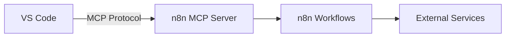

# n8n MCP Configuration Plan

## Overview
Configure n8n as an MCP server for use with Claude in VS Code.

## Requirements Summary
| Item | Value |
|------|-------|
| n8n URL | `https://n8n.example.com` |
| Hosting | Self-hosted VPS |
| Auth | Internal network only |
| Client | VS Code with Claude Extension |
| Use Case | Multiple (AI, automation, tool integration) |

---

## Architecture



---

## Step 1: Enable MCP Server in n8n

In your n8n instance settings (`https://n8n.example.com`):

1. Go to **Settings** → **MP Server**
2. Enable the built-in MCP server
3. Note the port (default: `5678` for n8n itself, MCP uses separate port)
4. Configure which workflows are exposed as MCP tools

---

## Step 2: Configure Claude VS Code Extension

Add to Claude settings (`settings.json`):

```json
{
  "mcpServers": {
    "n8n": {
      "url": "https://n8n.example.com/mcp",
      "transport": "streamable-http"
    }
  }
}
```

Or via Claude Desktop Settings UI:
- Open Claude Settings → MCP Servers
- Add n8n with the streamable-http transport

---

## Step 3: Security Consideration

⚠️ **Warning**: Since your n8n is on a public VPS with no authentication, consider:

1. **VPN/Private Network**: Ensure only trusted clients can access n8n
2. **API Key**: Add n8n API key for MCP authentication
3. **Reverse Proxy**: Configure nginx/caddy with basic auth

---

## Step 4: Test Connection

1. Restart Claude VS Code Extension
2. Ask Claude: "What n8n workflows do you have access to?"
3. Verify workflow execution

---

## Next Steps
- [ ] Enable MCP in n8n admin panel
- [ ] Configure firewall rules (if needed)
- [ ] Add MCP server to Claude settings
- [ ] Test with a simple workflow

---

## MCP Configuration

**File**: `.roo/mcp.json`

```json
n8n=https://n8n.infinitymade.de/mcp
```

### To Apply:
Switch to Code mode to update `.roo/mcp.json` with the n8n configuration.
