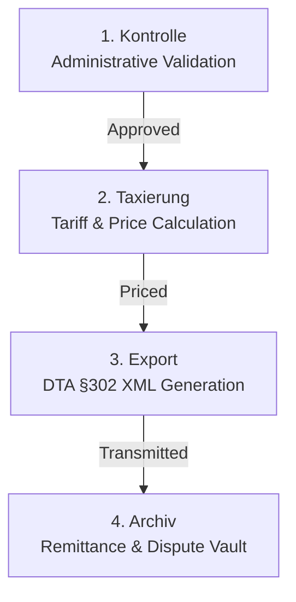

# Competitor Analysis Deep-Dive: Optica Billing, Compliance, and Finance

This report provides a precise, technical competitor analysis of **Optica Viva**'s core billing, auditing, and financial suite. It serves as a product roadmap specification for **InfinityMade** to bridge compliance and accounting gaps for German Heilmittel (remedy/therapy) providers.

---

## 1. Compliance & Auditing Module (Prüfung)

The **Prüfung** section is a central compliance dashboard that acts as a gatekeeper before prescriptions move to the billing pipeline. In Germany, GKV (public health insurance) clearing centers strictly reject claims for even minor administrative errors (leading to *Absetzungen* or chargebacks). Optica's rules engine automates the validation of these complex regulatory requirements.

### 1.1 HMR-Prüfung (Heilmittel-Richtlinien Check)
*   **What it does:** Scans active prescriptions against the federal *Heilmittel-Richtlinie* (Remedy Guidelines) to identify errors that would trigger immediate rejections by public insurers.
*   **German Regulatory Logic:**
    *   **Behandlungsbeginn (Treatment Start):** By law (§ 12 HMR), treatment must commence within **28 calendar days** of the prescription date. If the physician marks the prescription as "dringlicher Behandlungsbedarf" (urgent therapeutic need), treatment must start within **14 calendar days**. Optica flags any first appointment scheduled outside this window.
    *   **Behandlungsunterbrechung (Treatment Interruption):** Treatments cannot be interrupted for more than **14 calendar days** (§ 16 HMR) without invalidating the remaining sessions. If a longer gap occurs, Optica forces the therapist to select a regulatory justification code:
        *   `K` - Illness (Krankheit)
        *   `T` - Therapeutic reasons (Therapeutische Gründe)
        *   `F` - Vacation/Holiday (Ferien/Urlaub)
        *   Interruption of more than **28 calendar days** invalidates the prescription completely.
    *   **Mengenbegrenzung (Quantity Limits):** Validates that the number of sessions does not exceed the maximum allowed for the specific *Indikationsschlüssel* (e.g., max 6 sessions per prescription for standard spine conditions).
    *   **Heilmittelkombinationen (Remedy Combinations):** Checks if the combination of primary remedies (e.g., *Krankengymnastik* - KG) and supplementary remedies (e.g., *Fango* - Wärmetherapie) is permitted under the diagnostic catalog.
*   **UI/Workflow:**
    *   A tabular list of prescriptions failing validation, featuring columns: `Rezeptdatum`, `Patient`, `Hinweis` (containing the specific error, e.g., *"Erstbehandlung Frist überschritten"*), and a quick edit action.
    *   Contains quick buttons to view the original prescription scan and adjust dates or add correction reasons.
*   **Artifact Reference:** 

### 1.2 Blankorezepte (Blankoverordnung)
*   **What it does:** Specifically monitors and tracks *Blankoverordnungen* (blank prescriptions), where the physician only prescribes a diagnosis, leaving the selection of the remedy, frequency, and quantity up to the therapist.
*   **German Regulatory Logic:**
    *   Under § 125a SGB V (active for Physiotherapy in 2024), the therapist acts as the clinical decision-maker. However, GKV enforces a strict **time and financial budget** per diagnostic group.
    *   The system must calculate and display real-time utilization of the allowed session caps and total treatment duration (minutes or cost) per case to prevent over-budget penalties.
*   **UI/Workflow:**
    *   Grid columns: `Rezeptdatum`, `Gültig bis`, `Patient`, `Geleistet` (Sessions delivered), `Geplant` (Sessions scheduled), `Status`.
    *   Provides an interactive progress meter showing how much of the dynamic budget has been consumed by the patient's current therapy plan.
*   **Artifact Reference:** 

### 1.3 Ausfalltermine (No-Show Charges)
*   **What it does:** Identifies patients who missed appointments without canceling in advance and manages the private invoicing of no-show fees.
*   **German Regulatory Logic:**
    *   According to **§ 615 BGB** (Annahmeverzug), a practice can privately charge patients for missed appointments if they were not canceled within 24 hours. Because public insurance (GKV) does *not* cover missed appointments, these must be billed as private out-of-pocket invoices.
*   **UI/Workflow:**
    *   A dedicated review grid displaying: `Erfasst am`, `Kasse` (patient's insurer), `Rezeptdatum`, `Patient`, `Therapeut`, `Offener Betrag` (e.g., €35.45 for a standard KG slot up to €50.60 for longer specialized slots).
    *   Allows clicking a line to immediately generate a GoBD-compliant private invoice or release the blocked slot back into the scheduler.
*   **Artifact Reference:** 

### 1.4 Zuzahlungen (Co-Payments)
*   **What it does:** Tracks and automates statutory co-payments (*Zuzahlungen*) that public patients must pay directly to the practice.
*   **German Regulatory Logic:**
    *   Under **§ 32 SGB V**, adult patients are obligated to pay a co-payment of **10% of the treatment value plus a flat €10 fee** per prescription.
    *   **Zuzahlungsbefreiung (Exemption):** Patients who exceed their annual out-of-pocket cap (usually 2% of gross income, or 1% for chronically ill patients) receive an exemption card (*Befreiungsausweis*). The system must capture the card number and validity date.
    *   The practice is legally required to collect this on behalf of the Krankenkasse; if a patient refuses to pay, a formal warning process (*Mahnverfahren*) must be initiated before the practice can reclaim the unpaid co-payment from the insurer.
*   **UI/Workflow:**
    *   Grid columns: `Rezeptdatum`, `1. Termin`, `Patient`, `Fällige Zuzahlung` (net calculated co-payment), `Gesamtzuzahlung` (total co-payment including flat fee), and payment status.
    *   Provides quick "Einzahlen" (Pay in) cash-register integration and prints a legally compliant receipt (*Quittung*).
*   **Artifact Reference:** 

### 1.5 Therapieberichte (Therapy Reports)
*   **What it does:** Monitors if a physician requested a therapy report and blocks final billing until the report is completed.
*   **German Regulatory Logic:**
    *   If the physician marks the checkbox "Therapiebericht angefordert" (Report requested) on the prescription, the therapist must submit a written progress report to the physician.
    *   Billing the GKV for the prescription *without* having generated this report can lead to partial or total payment rejections.
*   **UI/Workflow:**
    *   Shows: `Patient`, `Kasse`, `Rezeptdatum`, `Therapeut`, `Termine` (e.g., "1 von 6" completed), `Status` (e.g., "in Arbeit" / in progress).
    *   Acts as a hard gate: prescriptions with reports marked "in Arbeit" are highlighted and blocked from transitioning to the billing pipeline.
*   **Artifact Reference:** 

### 1.6 Additional Audits
*   **Tarifänderung (Tariff Adjustments):** Displays prescriptions affected by mid-treatment rate changes. The system manages the splitting of lines so that sessions before the effective date are billed at the old rate, and subsequent sessions at the new rate.
*   **Wiedervorlage (Follow-ups):** A task management dashboard for administrative follow-ups (e.g., tracking when a patient's temporary co-payment exemption card is expiring).
*   **Verkäufe (Retail Sales):** Manages non-prescription retail products sold in the practice (e.g., physical therapy bands, massage oils).
*   **Offene Termine (Incomplete Appointments):** Lists completed treatments that haven't been assigned to a prescription, preventing lost revenue.
*   **Artifact References:** 
    *   
    *   
    *   
    *   
    *   
    *   

---

## 2. Structured Billing Pipeline (Abrechnung)

The billing pipeline consists of four highly structured stages, moving prescriptions from raw appointment logs to validated financial claims.

### 2.1 Stage 1: Kontrolle (Validation)
*   **What it validates:** Performs comprehensive administrative and master data integrity checks.
*   **German Regulatory Logic:**
    *   Verifies that the physician's 9-digit **LANR** (Arztnummer), the clinic's **BSNR** (Betriebsstättennummer), and the **IK-Nummer** (Institutionskennzeichen) of the insurer are structurally valid and correctly combined.
    *   Enforces the **ZANR** (Zahnarztnummer) mandate (active since Jan 1, 2023): dentists and orthodontists must supply their unique numeric dentist ID; generic placeholder codes (e.g., `999999999`) are rejected.
    *   Validates special rules for **Entlassmanagement** (hospital discharge prescriptions, which are only valid for 7 days post-discharge and require specific LANR codes like `4444444`).
*   **UI/Workflow:** Shows validation summaries and throws warning pop-ups if data is missing or invalid.
*   **Artifact Reference:** 

### 2.2 Stage 2: Taxierung (Pricing)
*   **What it does:** Automatically assigns official remedy catalog prices to the treatment items based on the diagnostic key.
*   **German Regulatory Logic:**
    *   Integrates with the official Heilmittelkatalog database to look up exact 5-digit GKV billing codes (e.g., `20501` for *Krankengymnastik*).
    *   Splits the gross amount into the 90% Krankenkasse share and the 10% co-payment share.
*   **UI/Workflow:** A review grid listing: `Patient`, `Brutto` (Gross total), and `Zuzahlung` (Co-payment). The therapist reviews the computed prices and signs off.
*   **Artifact Reference:** 

### 2.3 Stage 3: Export (DTA §302 Transmission)
*   **What it does:** Bundles priced prescriptions and prepares the electronic data exchange (DTA - Datenträgeraustausch) transmission file.
*   **German Regulatory Logic:**
    *   Generates structured files complying with **§ 302 SGB V** (electronic billing standards for remedy providers).
    *   Handles EDIFACT-based formatting and generates the mandatory physical accompaniment slips (*Abrechnungsbegleitzettel*) that must be signed and mailed along with the original paper prescriptions to the paper scanning centers of the GKV clearing houses.
*   **UI/Workflow:** Selectable batches of GKV invoices with a one-click "Exportieren" button.
*   **Artifact Reference:** 

### 2.4 Stage 4: Archiv
*   **What it does:** A historical repository of all past billing runs, clearing-house receipts, and payment status updates.
*   **UI/Workflow:** Searchable history filtered by `Abrechnungszentrum` (clearing house), `Datum`, `Anzahl` (quantity), `Gesamtbrutto`, and `Rechnungsbetrag`.
*   **Artifact Reference:** 

---

## 3. Financial Suite (Finanzen)

Optica contains a full financial sub-suite designed to manage cash flow and comply with German tax laws (*GoBD*).

### 3.1 Offene Posten (OPOS - Accounts Receivable)
*   Tracks outstanding co-payments and private patient invoices.
*   **UI/Workflow:** Displays: `Patient`, `Kontosaldo` (ledger balance), `RE-Nummer` (invoice number), `RE-Datum`, `RE-Betrag`, `RE fällig am` (due date), and `Status`. Includes quick options to record cash receipts.
*   **Artifact Reference:** 

### 3.2 Belegliste (Receipt Ledger)
*   Maintains a chronologically ordered list of cash ledger and bank transactions.
*   **German Regulatory Logic:** Enforces the strict requirements of **GoBD** (principles of proper double-entry bookkeeping). Every cash transaction must be immediately logged with a unique invoice link and cannot be modified or deleted without generating an audit trail (cancellation receipt).
*   **Artifact Reference:** 

### 3.3 Einnahmenprognose (Revenue Forecast)
*   **What it does:** Forecasts future liquidity based on scheduled appointments.
*   **German Regulatory Logic:**
    *   Public insurance rates are fixed. Since the system knows the exact diagnostic keys and schedules of the therapist, it can forecast near-term gross revenue before the treatments are even billed.
*   **UI/Workflow:** A forward-looking calendar month-by-month table detailing: `Periode`, `Geleistet` (revenue already locked in), `Termine verplant` (revenue currently scheduled), and `Summe` (total forecast).
*   **Artifact Reference:** 

### 3.4 Mahnwesen (Dunning Engine)
*   **What it does:** Automatically manages payment collection and late reminders.
*   **UI/Workflow:** Displays outstanding accounts separated by active dunning levels (`Zahlungserinnerung` -> `1. Mahnung` -> `2. Mahnung`). Integrates with templates to print formal German dunning letters with automated interest and late fee calculations.
*   **Artifact Reference:** 

### 3.5 Patientenkonten (Patient Accounts Ledger)
*   Displays a double-entry ledger account per patient to track deposit balances, advanced payments, and unpaid co-payment receivables.
*   **Artifact Reference:** 

### 3.6 Financial Journals (Journale)
*   Historical record of all financial postings ready for date-filtered export (e.g., to DATEV for tax accountants).
*   **Artifact Reference:** 

---

## 4. Configuration & Master Data (Verwaltung & Einstellungen)

### 4.1 Tarife (Price Catalogs)
*   **What it does:** Configures the pricing matrices for all German health insurers.
*   **German Regulatory Logic:**
    *   **Tarifsplitting:** GKV pricing agreements change regularly. The system supports *Wechseltyp* (splitting based on either treatment date or prescription date), ensuring accurate calculations even when prices shift mid-treatment.
*   **Artifact Reference:** 

### 4.2 Krankenkassen (Insurers Master Data)
*   **What it does:** Manages a directory of health insurers mapping their physical addresses and electronic ID systems to their official 9-digit **IK-Nummern** (Institutionskennzeichen).
*   **Artifact Reference:** 

### 4.3 Einstellungen -> Abrechnung (Billing Settings)
*   **What it does:** Configuration center for payment terms, practice IK numbers, BSNRs, and dunning engine rules.
*   **Artifact Reference:** 

---

## 5. Prioritized Product Roadmap: Gaps InfinityMade Must Close

To compete with Optica's core compliance moat, **InfinityMade** must close the following gaps. These are categorized by urgency, regulatory impact, and implementation complexity.

| Priority | Feature / Gap | Regulatory Reason | Complexity |
| :--- | :--- | :--- | :--- |
| **Must-Have** | **HMR-Prüfung Rules Engine** | Missed start dates (>28 days) and illegal therapy interruptions (>14 days) lead to 100% claim rejections by GKV clearing houses. | **High** (requires building a validation rules engine tracking calendar dates, therapist sick-leave codes, and diagnostic combinations). |
| **Must-Have** | **Zuzahlung (Co-payment) Tracking** | Legally required under § 32 SGB V. The system must automatically calculate the 10% + €10 split, issue receipts, and log Befreiung card numbers. | **Medium** (requires additions to patient schemas and printing GoBD-compliant receipts). |
| **Must-Have** | **ZANR & LANR/BSNR Integrity Checks** | Necessary for SGB V compliance. Direct billing (§302 SGB V) is immediately blocked or rejected if physician/dentist master data is malformed. | **Low-Medium** (validation scripts and error alerts in the front-end before export). |
| **Nice-to-Have** | **Blankoverordnung Tracking** | Rapidly growing requirement in Germany since 2024. Therapists need to track patient-specific session and minute budgets dynamically. | **High** (requires real-time budget-depletion gauges and time-spent trackers in the scheduler). |
| **Nice-to-Have** | **GoBD Belegliste (Receipt Ledger)** | Vital for tax audits. A simple database table will not pass German tax audits; cash entries must be audit-locked. | **Medium** (requires immutable append-only ledger tables and double-entry transaction logic). |
| **Nice-to-Have** | **Mahnwesen (Dunning Engine)** | Enhances clinic productivity. Practices need printable dunning letters when patients fail to pay their statutory co-payments. | **Medium** (requires German document template rendering and automated date-due tracking). |
